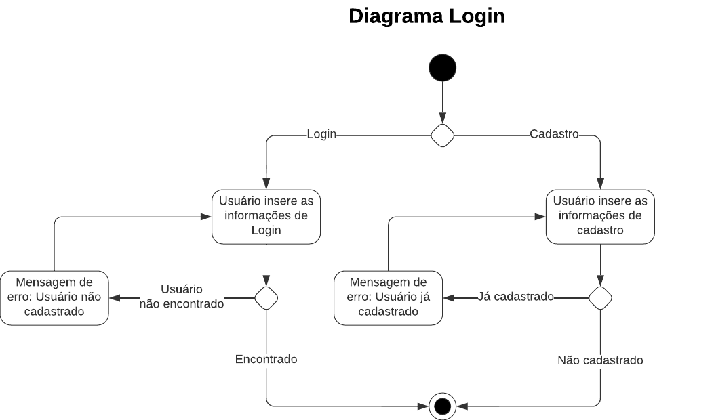
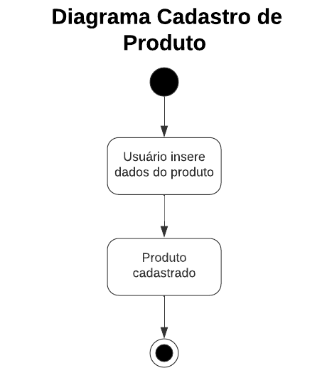
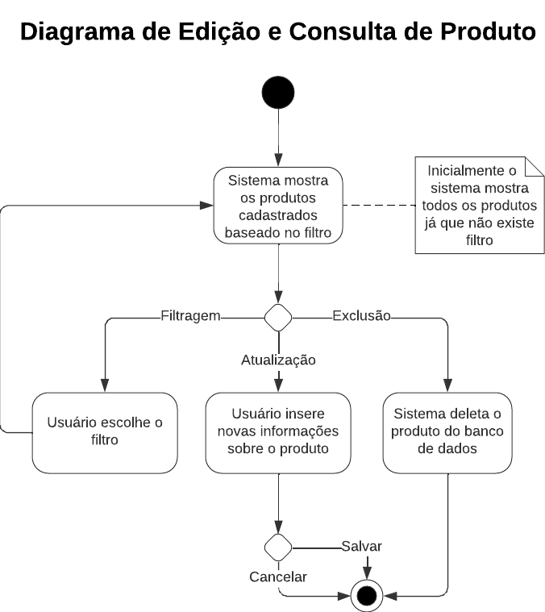
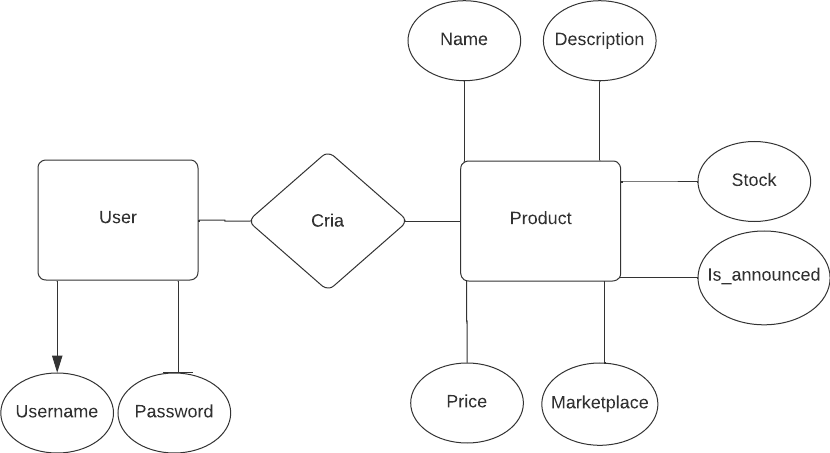
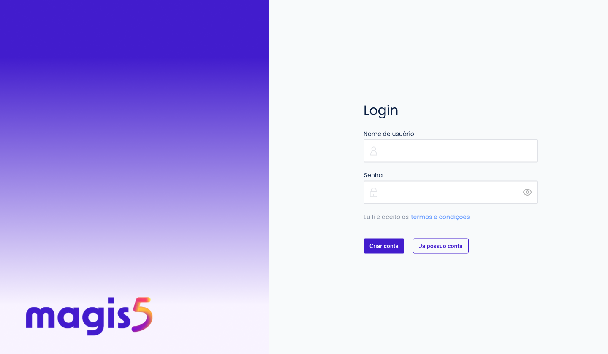
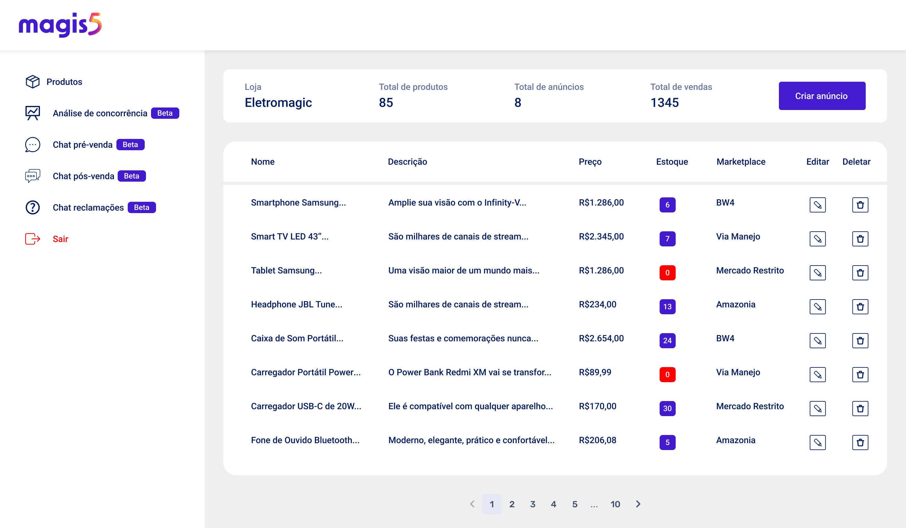
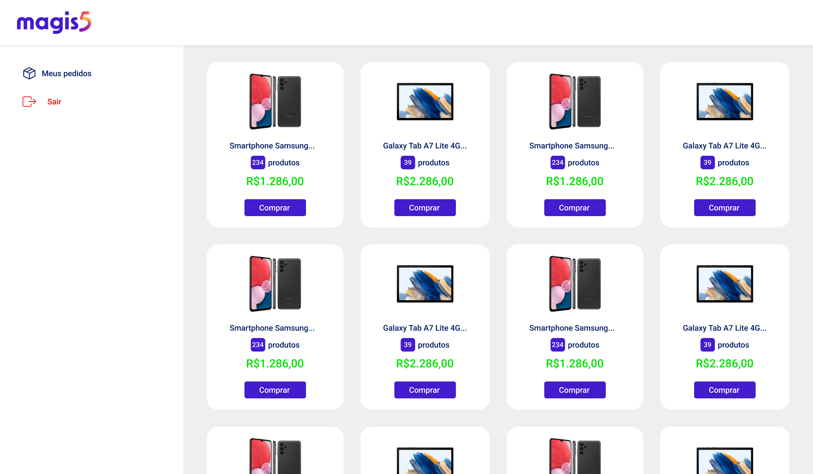
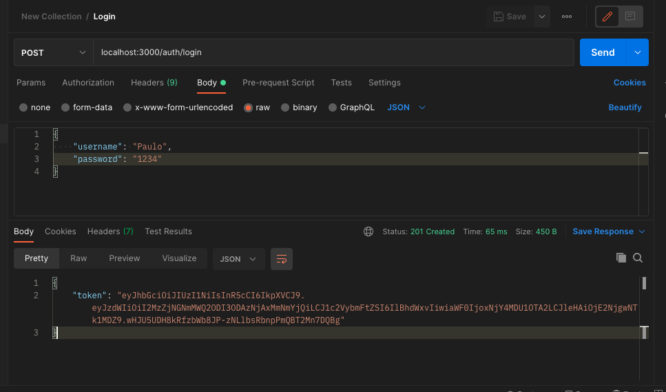

---
hide:
  - navigation
---

# Documentação Técnica

## Requisitos Funcionais

### Solução 1 - ERP

1. O usuário deve poder cadastrar novos produtos com nome, descrição e estoque.
2. O estoque deve ser atualizado tanto via ERP quanto via requisição de sistema Centralizador de Vendas.

### Solução 2 - Marketplace

1. O sistema deve poder cadastrar anúncios requisitados pelo Centralizador de Vendas.
2. O usuário deve poder comprar produtos anunciados.
3. O sistema deve enviar a informação de que uma compra foi feita para o Centralizador de Vendas.
4. O sistema deve poder atualizar os valores de estoque com a requisição do Centralizador de Vendas.

### Solução 3 - Centralizador de Vendas

1. O usuário deve poder consultar a base de produtos cadastrados.
2. O usuário deve poder editar produtos cadastrados.
3. O usuário poder excluir produtos cadastrados.
4. O usuário deve poder requisitar a criação de novos anúncios nos Marketplaces conectados ao sistema.
5. O sistema deve atualizar o estoque com a chegada da requisição do Marketplace.

## Diagramas de Atividade

{: class="aligncenter"}

{: class="aligncenter"}

{: class="aligncenter"}

## Modelo do Banco de Dados

{: class="aligncenter")

## Requisitos Técnicos

### Front End

Foi criado um protótipo de como o Centralizador de Vendas se pareceria na sua versão final utilizando o [Figma](https://www.figma.com/). Nossa ideia era de desenvolver um Front End funcional utilizando HTML, CSS e JavaScript porém devido o tempo e as complicações e isso não foi possível.

Também foi feito uma tela simbólica para a solução 2, do Marketplace.

### Back End

#### O que foi feito

Foi criada um cluster remoto no [MongoDB Atlas](https://www.mongodb.com/cloud/atlas/lp/try4?utm_content=rlsavisitor&utm_source=google&utm_campaign=search_gs_pl_evergreen_atlas_core_retarget-brand_gic-null_amers-all_ps-all_desktop_eng_lead&utm_term=atlas%20mongodb&utm_medium=cpc_paid_search&utm_ad=e&utm_ad_campaign_id=14412646314&adgroup=131761122132&gclid=CjwKCAiAvK2bBhB8EiwAZUbP1GOoltN5jRe1EhgiHwsi7H2FMdRNo06sMQZBCaqKgPXi1CIGc-V3VRoCnBoQAvD_BwE) para que pudesse servir como nossa base de dados. Para nossa aplicação, Node.js juntamente com Nestjs foram utilizados para compor o back end.

Criamos um método de criar e atualizar usuários no cluster, e também desenvolvemos um método de autenticação para os mesmos. O Login é feito e um token de autorização é retornado para que o acesso ao BD remoto seja garantido.

Criamos também um método para criar e inserir produtos no BD. No qual o app utiliza-se do token de autenticação gerado para inserir um produto no BD, no qual, conta com o `username` como chave estrangeira para identificação de qual usuário é dono do respectivo produto.

### O que queríamos ter feito

Considerando o pouco tempo disponível para o desenvolvimento, acabamos sem finalizar as seguintes funcoes:

- updateProduto
- anunciaProduto

A ideia de `updateProduto` é chamar um endpoint que seria responsável por atualizar o produto com novos dados inseridos pelo usuário.

Já a de `anunciaProduto` seria apenas um set da variável anuncia como `true` e um update na sua variável de array com o respectivo marketplace anunciado, para que apenas os produtos anunciados fossem exibidos na página de marketplace.
